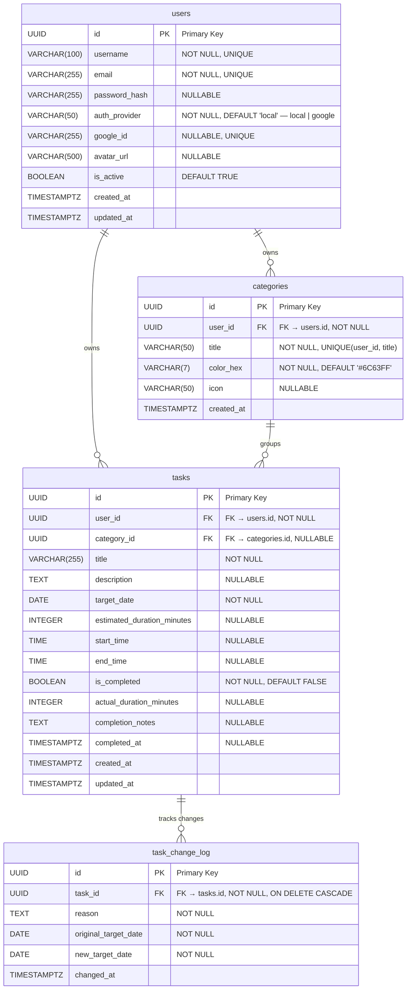

# TaskExecutor — Entity Relationship Diagram

## Schema Overview

The TaskExecutor database is built on **four core tables** that model a personal task-management system with multi-auth user accounts, categorised tasks, and a change-tracking audit log.

| Table | Purpose |
|---|---|
| **users** | Stores user accounts supporting both local (password) and Google OAuth authentication. |
| **categories** | User-defined groupings for tasks, each with a colour and optional icon. A composite unique constraint on `(user_id, title)` prevents duplicate category names per user. |
| **tasks** | The central entity — individual to-do items owned by a user and assigned to a category, with scheduling fields (`target_date`, `start_time`, `end_time`) and completion tracking. |
| **task_change_log** | An append-only audit trail that records every time a task's target date is changed, capturing the reason and both the original and new dates. Rows cascade-delete when the parent task is removed. |

### Relationship Summary

| Relationship | Cardinality | FK Column | Notes |
|---|---|---|---|
| `users` → `categories` | One-to-Many | `categories.user_id` | Each user owns zero or more categories. |
| `users` → `tasks` | One-to-Many | `tasks.user_id` | Each user owns zero or more tasks. |
| `categories` → `tasks` | One-to-Many | `tasks.category_id` | Every task can belong to a category (nullable UUID). |
| `tasks` → `task_change_log` | One-to-Many | `task_change_log.task_id` | A task may have zero or more change-log entries. Deleting a task cascades to its log. |

---

## ER Diagram

---

> [!NOTE]
> **Rendering** — This diagram uses [Mermaid `erDiagram`](https://mermaid.js.org/syntax/entityRelationshipDiagram.html) syntax. It renders natively on GitHub, GitLab, and in VS Code with the *Markdown Preview Mermaid Support* extension.
