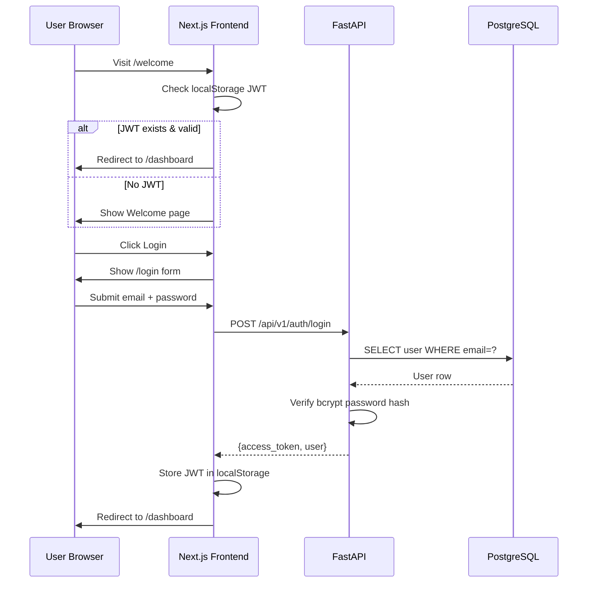
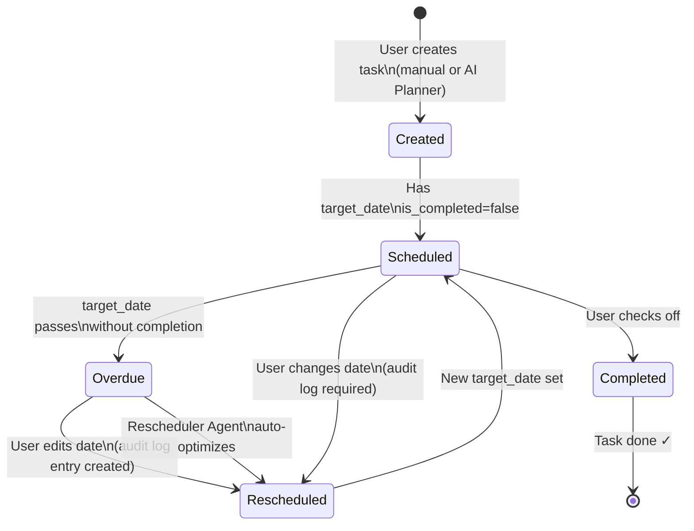
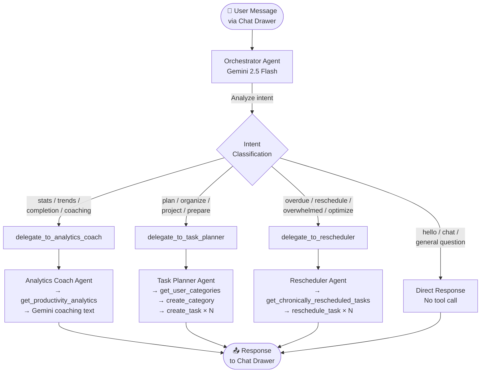
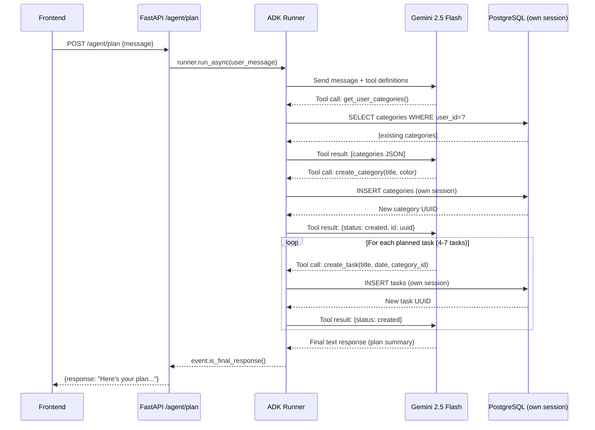
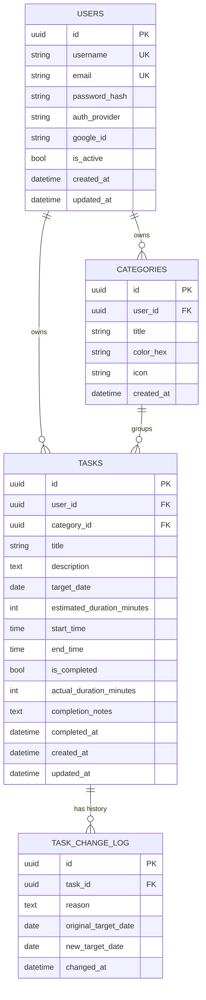
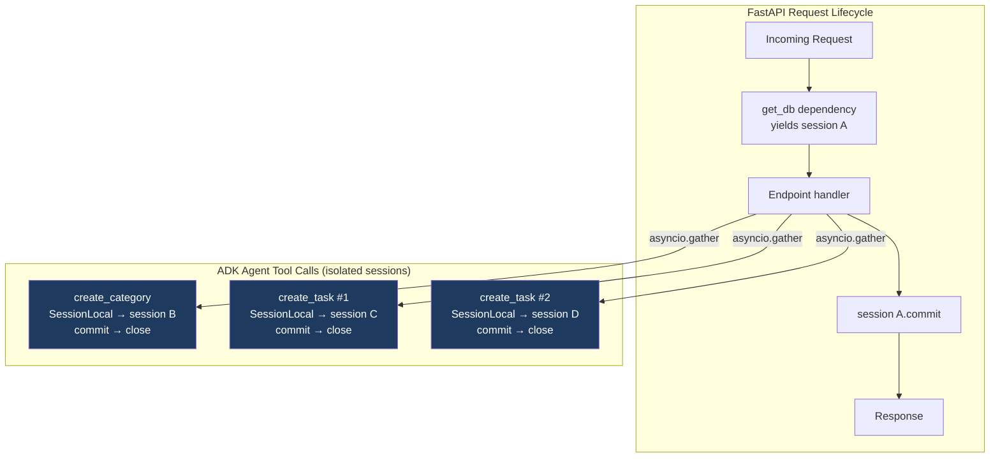

# System Flow Diagrams — TaskExecutor

> All key data flows and agent interactions visualized with Mermaid diagrams

---

## 1. Application Architecture Overview

```mermaid
graph TB
    subgraph Frontend["🌐 Next.js 16 Frontend"]
        WP[Welcome Page]
        Auth[Auth Pages\nLogin · Register]
        DB_Page[Dashboard\nToday's Tasks + AI Briefing]
        Tasks[Tasks Page\nCategories Accordion]
        Analytics[Analytics Page\nStats + AI Coach]
        TaskEdit[Task Edit Page\nAI Subtask Generator]
        ChatDrawer[AI Chat Drawer\nFloating Across All Pages]
    end

    subgraph Backend["⚙️ FastAPI Backend"]
        AuthAPI[/auth/\nJWT · OAuth]
        TasksAPI[/tasks/\nCRUD + Complete]
        CatsAPI[/categories/\nCRUD]
        AgentAPI[/agent/\nAI Endpoints]
    end

    subgraph Agents["🤖 Google ADK 2.0 Agent Fleet"]
        Analytics_A[Analytics Coach\nread-only]
        Planner_A[Task Planner\ncreates tasks]
        Reschedule_A[Rescheduler\noptimizes dates]
        Orchestrator_A[Orchestrator\nroutes requests]
    end

    DB[(PostgreSQL\nUsers · Tasks\nCategories\nTaskChangeLog)]
    Gemini[☁️ Gemini 2.5 Flash]

    Frontend -->|REST + JWT| Backend
    Backend --> DB
    AgentAPI --> Agents
    Agents --> DB
    Agents -->|ADK SDK| Gemini
```

---

## 2. User Authentication Flow



---

## 3. Task Lifecycle Flow



---

## 4. Orchestrator Agent Routing Flow



---

## 5. Task Planner Agent Tool Loop



---

## 6. Rescheduler Agent Flow

```mermaid
flowchart LR
    Start([Trigger:\n"Reschedule my overdue tasks"]) --> Fetch

    subgraph ReschedulerAgent["🔄 Rescheduler Agent"]
        Fetch[get_chronically_rescheduled_tasks\nScans: overdue + rescheduled before]
        Fetch --> Empty{Any\ntasks found?}
        Empty -->|No| Healthy[Return: Schedule is healthy! ✅]
        Empty -->|Yes| Analyze[Gemini analyzes each task\ncurrent_date + reschedule_count + history]
        Analyze --> Schedule[Calculate balanced\nnew target dates\nno overloading per day]
        Schedule --> Write[reschedule_task × N\nUpdates Task.target_date\nInserts TaskChangeLog]
        Write --> Summary[Return change summary\nwith reasons]
    end

    Healthy --> Done([Response to User])
    Summary --> Done
```

---

## 7. Database Schema (ERD)



---

## 8. Session Isolation Pattern (Agents vs FastAPI)



> **Why this matters:** SQLAlchemy `AsyncSession` is not thread/task-safe. If multiple ADK tools shared the same session, concurrent flushes would cause `IllegalStateChangeError`. Independent sessions eliminate this entirely.

---

## 9. Frontend Page Navigation Map

```mermaid
graph LR
    Welcome[/welcome\nLanding Page] -->|Login| Login[/login]
    Welcome -->|Register| Register[/register]
    Login -->|JWT stored| Dashboard[/ Dashboard\nToday's Tasks]
    Register -->|JWT stored| Dashboard

    Dashboard --> TaskEdit[/tasks/taskId\nEdit + AI Subtasks]
    Dashboard --> DateView[/date/date\nDate-specific Tasks]
    Dashboard --> Tasks[/tasks\nAll by Category]
    Dashboard --> Analytics[/analytics\nStats + Coach]
    Dashboard --> NewTask[/tasks/new\nCreate Task]

    Tasks --> TaskEdit
    DateView --> TaskEdit

    subgraph AI["AI Interactions (available on all pages)"]
        ChatDrawer[AI Chat Drawer\nfloating button]
    end
```
