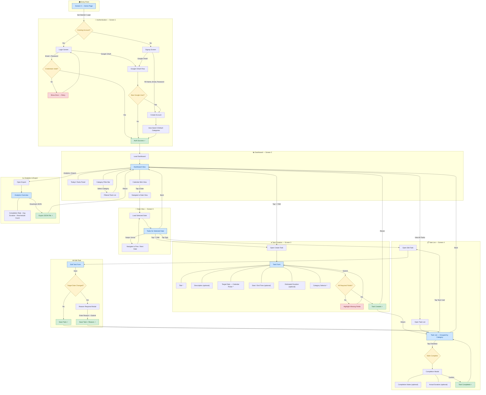

# TaskExecutor — Complete User Flow Diagram

> **Version**: 1.0  
> **Last Updated**: 2026-06-21  
> **Screens Covered**: Screen 0 (Home) · Screen 1 (Auth) · Screen 2 (Dashboard) · Screen 3 (Create Task) · Screen 4 (Task List) · Screen 5 (Date View)

---

## Flow Diagram

---

## Screen ↔ Flow Reference

| Screen | Name | Key Entry Points | Key Exits |
|--------|------|------------------|-----------|
| **Screen 0** | Home Page | App launch | → Auth (Login / Signup) |
| **Screen 1** | Login / Signup | Home → "Get Started" | → Dashboard (on success) |
| **Screen 2** | Dashboard | Auth success, Back from any child | → Task List, Create Task, Date View, Export |
| **Screen 3** | Create Task | Dashboard / Date View → "+" FAB | → Dashboard, Task List |
| **Screen 4** | Task List | Dashboard → "View All Tasks" | → Edit Task, Dashboard |
| **Screen 5** | Date View | Dashboard → Calendar date tap | → Edit Task, Create Task, Dashboard |

---

## Text-Based Flow Description (Accessibility)

The following narrative describes every path a user can take through the TaskExecutor app. Each numbered section corresponds to a subgraph in the diagram above.

### 1 · Entry Point — Screen 0

The user opens the app and lands on the **Home Page**. A single call-to-action button ("Get Started" / "Login") directs them into the authentication flow.

### 2 · Authentication — Screen 1

| Path | Steps |
|------|-------|
| **Email Login** | Enter email + password → validate → if valid, proceed to Dashboard; if invalid, show error and retry. |
| **Google OAuth (existing)** | Tap "Continue with Google" → Google consent → account found → proceed to Dashboard. |
| **Signup (email)** | Fill name, email, password → create account → system auto-seeds **3 default categories** → proceed to Dashboard. |
| **Google OAuth (new)** | Tap "Continue with Google" → Google consent → no existing account → create account → auto-seed categories → proceed to Dashboard. |

### 3 · Dashboard — Screen 2

After authentication the user lands on the **Dashboard**. The screen contains:

1. **Today's Tasks Panel** — lists all tasks whose `target_date` equals today.
2. **Calendar Mini-View** — a compact month calendar; tapping a date navigates to the **Date View (Screen 5)**.
3. **Category Filter Bar** — dropdown or chip bar; selecting a category filters the visible task list.

From the Dashboard the user can:

- Tap the **"+" FAB** → go to **Create Task (Screen 3)**.
- Tap **"View All Tasks"** → go to **Task List (Screen 4)**.
- Tap a **calendar date** → go to **Date View (Screen 5)**.
- Tap **"Analytics / Export"** → go to the **Export** flow.

### 4 · Task Creation — Screen 3

The Create Task form contains the following fields:

| Field | Required | Input Type |
|-------|----------|------------|
| Title | ✅ Yes | Text |
| Description | ❌ No | Text (multiline) |
| Target Date | ✅ Yes | Calendar date picker |
| Start Time | ❌ No | Time picker |
| End Time | ❌ No | Time picker |
| Estimated Duration | ❌ No | Numeric (minutes) |
| Category | ✅ Yes | Dropdown / selector |

On submit:

- If required fields are missing → highlight errors, remain on form.
- If valid → save task → return to **Dashboard** or **Task List**.

### 5 · Task List — Screen 4

Tasks are displayed **grouped by category**. Each task card shows title, date, status, and category colour.

**Completing a task:**

1. Tap the checkbox on a task card.
2. A **Completion Modal** appears with optional fields:
   - Completion Notes (text)
   - Actual Duration (minutes)
3. Confirm → task is marked as completed; list refreshes.

**Editing a task:**

1. Tap the task card body → navigate to the **Edit Task** form.

### 6 · Edit Task Flow

The user modifies any field on the Edit Task form. On save:

| Condition | Behaviour |
|-----------|-----------|
| `target_date` **not changed** | Task saves immediately. |
| `target_date` **changed** | A **"Reason Required"** modal appears. The user must enter a reason for rescheduling before the task can be saved. The reason is stored for analytics. |

After saving (with or without a reason), the user returns to the **Task List (Screen 4)**.

### 7 · Date View — Screen 5

Reached by tapping a date on the Dashboard calendar. The screen shows **all tasks for the selected date**.

From here the user can:

- **Tap a task** → open the Edit Task form.
- **Tap the "+" FAB** → create a new task (pre-filled with the selected date).
- **Swipe or tap arrows** → move to the previous or next date.
- **Tap "Back"** → return to the Dashboard.

### 8 · Export / Analytics

Reached from the Dashboard via an "Analytics / Export" button.

- Displays an **Analytics Overview** with key metrics:
  - Completion Rate (%)
  - Average Actual Duration vs. Estimated Duration
  - Reschedule Count (number of date changes with reasons)
- The user can tap **"Download JSON"** to export all metrics and task data as a JSON file.
- After download (or cancel), the user returns to the Dashboard.

---

> [!NOTE]
> All backward navigation ("Back" buttons, swipe-back gestures) returns the user to the **Dashboard (Screen 2)** unless they entered a sub-flow from a different parent (e.g., Date View → Edit returns to Date View).

> [!TIP]
> The "+" FAB (Floating Action Button) is available on **Screen 2 (Dashboard)** and **Screen 5 (Date View)** so users can create tasks from wherever they browse.
